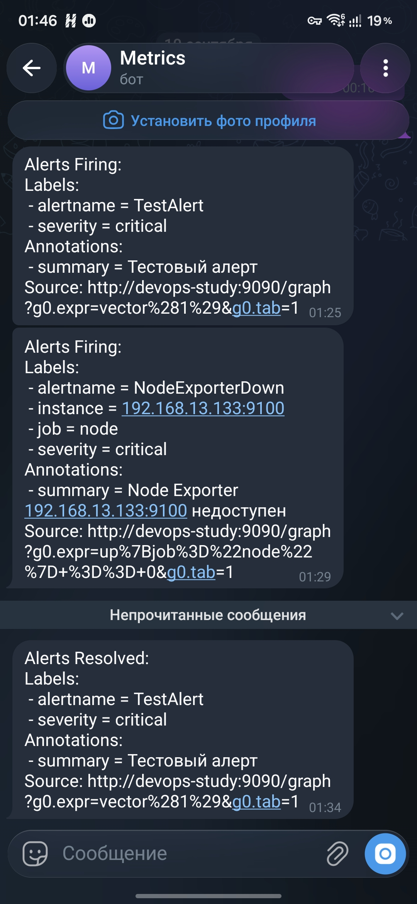

```
# Мой отчет за День 8: Non-root контейнер и мониторинг

## Что было сделано

### 1. Запустил контейнер не от root

Добавил в Dockerfile `appuser`:

```dockerfile
RUN useradd -m appuser
COPY --from=builder /root/.local /home/appuser/.local
ENV PATH=/home/appuser/.local/bin:$PATH
COPY --chown=appuser:appuser . .
USER appuser
```

### 2. node_exporter на managed-нодах

Через Ansible, `get_url` > `unarchive` → `copy` > systemd-юнит. Порт 9100

### 3. Prometheus на control node

Скачал, порт 9090. Собирает node_exporter с 133/134 + сам себя. Порт 9090 пришлось освободить? на нём висел сайт, снёс контейнер. Все равно если и буду работать с ними то только на maanged.

### 4. Alertmanager + Telegram

Поставил Alertmanager (порт 9093), настроил `alertmanager.yml` на нативный telegram-ресивер:

```yaml
route:
  receiver: telegram
  group_by: ['alertname']
  group_wait: 30s
  repeat_interval: 1h

receivers:
  - name: telegram
    telegram_configs:
      - bot_token: "{{ токен }}"
        chat_id: 5534301096
        parse_mode: HTML
```

Связал с Prometheus через `alerting:` и правило `up{job="node"} == 0`. Тестовым алертом проверил всю цепочку, пришло в Telegram.

## Разбор ошибок

| Ошибка | Что я понял |
|---|---|
| systemd юнит не стартует, Permission denied | Забыл `chmod +x`. |
| Порт 9090 занят | На нём висел контейнер сайта - снёс, освободил. |
| `alerting already set in type config.plain` | В prometheus.yml продублировал секцию `alerting:`. |
| Алерты не считаются (`groups: []`) | `rule_files:` в конфиге не указал rules.yml. |
| Слал в 127.0.0.1:5001 вместо Telegram | В alertmanager.yml остались два route/receivers (дефолтный web.hook + мой telegram). Alertmanager взял web.hook. Убрал web.hook. |
| api.telegram.org не отвечает | Telegram заблокирован в РФ. |

## Итог

Теперь у меня есть:
- контейнер, работающий от непривилегированного пользователя
- node_exporter на каждой ноде (метрики железа/ОС)
- Prometheus
- Alertmanager, который шлёт алерты мне в Telegram


Осталось из мониторинга: **blackbox_exporter** и потом Grafana-дашборд.
